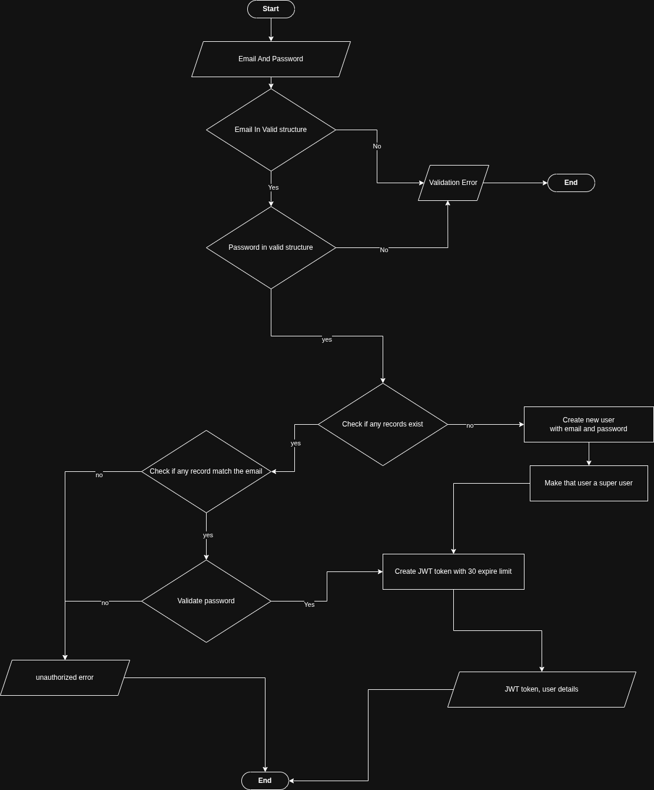

| ID     | SR-AUTH-01           |
|--------|----------------------|
| Author | Rajinda Wanigasingha |
| Date   | 2025/01/09           |

## Create first super-user

**Description**

- System shall use a one-time function to create a single super-user with a valid email and a password

**Inputs**

- Email - Must be in valid email format
- Password - Must be bigger than 8 characters and must include a special character (@#$*&), Number, Capital and simple letters

**Output**

- JWT token
- User details : user-name, user-id ,user-role
- Unauthorized error : If email or password incorrect of doesn't exist
- Validate error : 

**Action**

- System shall take email and password as inputs, then validate if email is in valid structure and password is in a valid structure.

- Then system shall check if any records exist in the database adminUser table, if there is no records, system shall create a new user with role of `super-user`
  from email and password provided then system shall create a JWT token with 30 day expire limit and output to the user with user-details.

- If there is records in the adminUser table system shall match email provided as an input with any email
  exist in the adminUser table, If email exist in the adminUser table system shall check if password provided as a input is same as password
  recorded in adminUser table, If password and email matched system shall create a JWT token with 30 day expire limit and output to the user with user-details,
  If the input email doesn't exist or the input password is incorrect system shall output unauthorized error.

**Requirements**

Email and a password

**Side effects**

None

**Pre-conditions and post-conditions**

None
